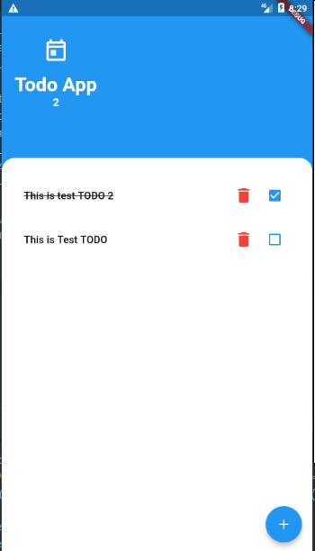
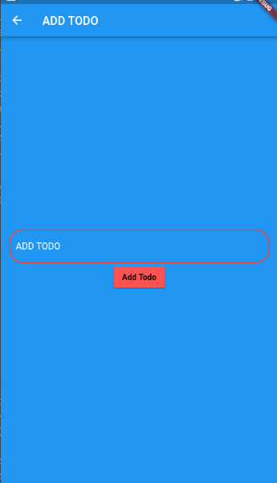
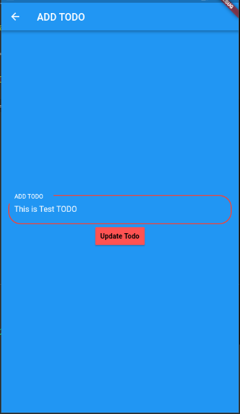

# TODO APP With  Offline Database SQLFLITE / SQLLITE 5

> pubspec.yaml
```
dependencies:
  cupertino_icons: ^1.0.0
  provider: ^4.3.2+2
  sqflite: ^1.3.1+2
  path_provider: ^1.6.22
  path: ^1.7.0
  ```
  # Home Page

  

  # Add TODO Page

  

  # Update TODO Page

  

  ## Start Project

  ```
  flutter clone <link>
  flutter create .
  ```